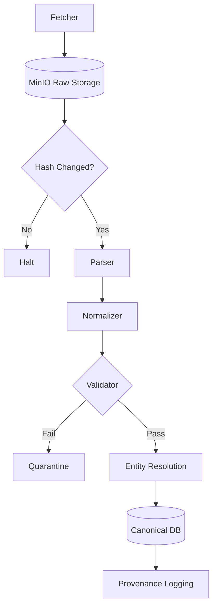

# Complete Ingestion Pipeline

```mermaid
graph TD
    Fetch[Fetcher] --> Minio[(MinIO Raw Storage)]
    Minio --> Check{Hash Changed?}
    Check -->|No| Halt
    Check -->|Yes| Parse[Parser]
    Parse --> Norm[Normalizer]
    Norm --> Validate{Validator}
    Validate -->|Fail| Quar[Quarantine]
    Validate -->|Pass| Resolve[Entity Resolution]
    Resolve --> Canonical[(Canonical DB)]
    Canonical --> Prov[Provenance Logging]
```
