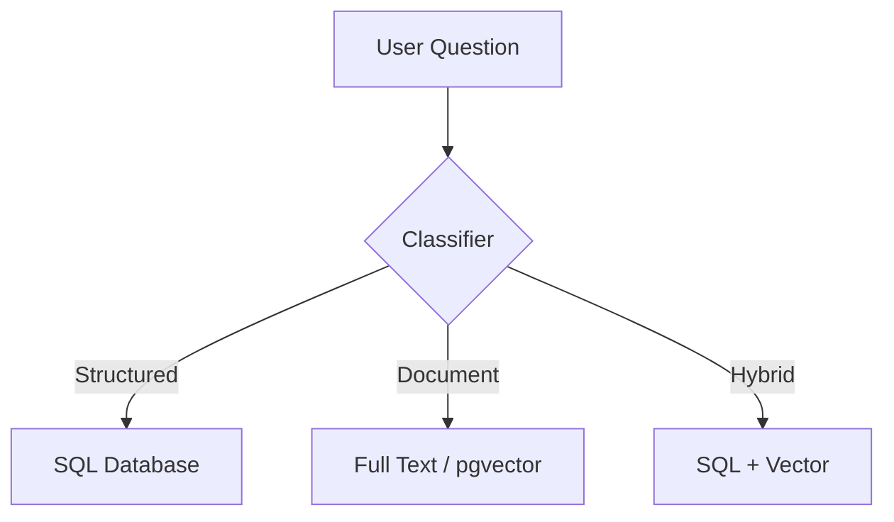

# Query Routing

```mermaid
graph TD
    Q[User Question] --> Classify{Classifier}
    Classify -->|Structured| SQL[SQL Database]
    Classify -->|Document| Vector[Full Text / pgvector]
    Classify -->|Hybrid| Fusion[SQL + Vector]
```
