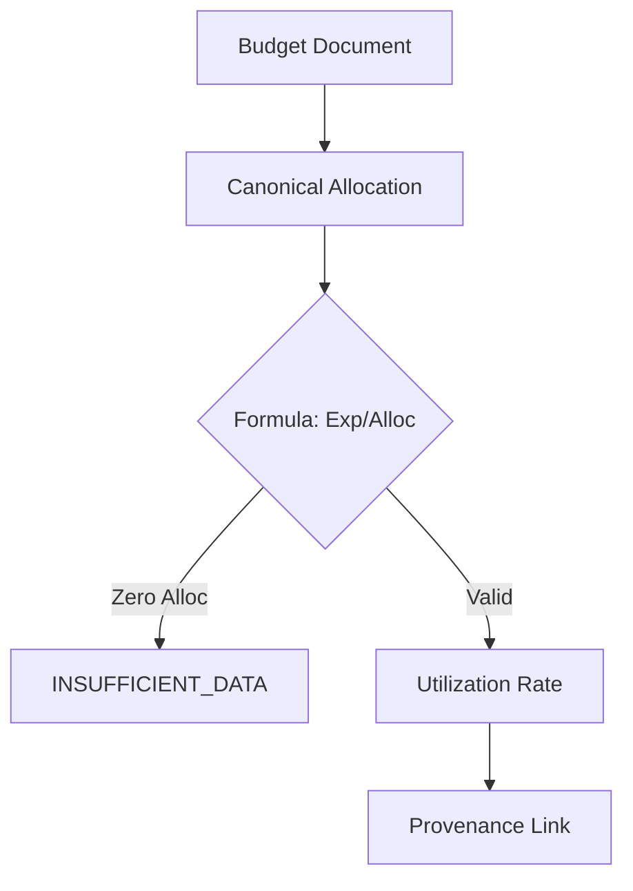

# Financial Flow

```mermaid
graph TD
    Budget[Budget Document] --> Canonical[Canonical Allocation]
    Canonical --> Math{Formula: Exp/Alloc}
    Math -->|Zero Alloc| Insuff[INSUFFICIENT_DATA]
    Math -->|Valid| Util[Utilization Rate]
    Util --> Citation[Provenance Link]
```
