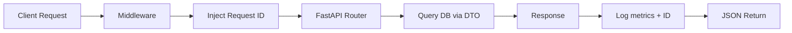

# Request Lifecycle

```mermaid
graph LR
    Req[Client Request] --> MW[Middleware]
    MW --> ID[Inject Request ID]
    ID --> Route[FastAPI Router]
    Route --> DB[Query DB via DTO]
    DB --> Res[Response]
    Res --> Trace[Log metrics + ID]
    Trace --> Client[JSON Return]
```
