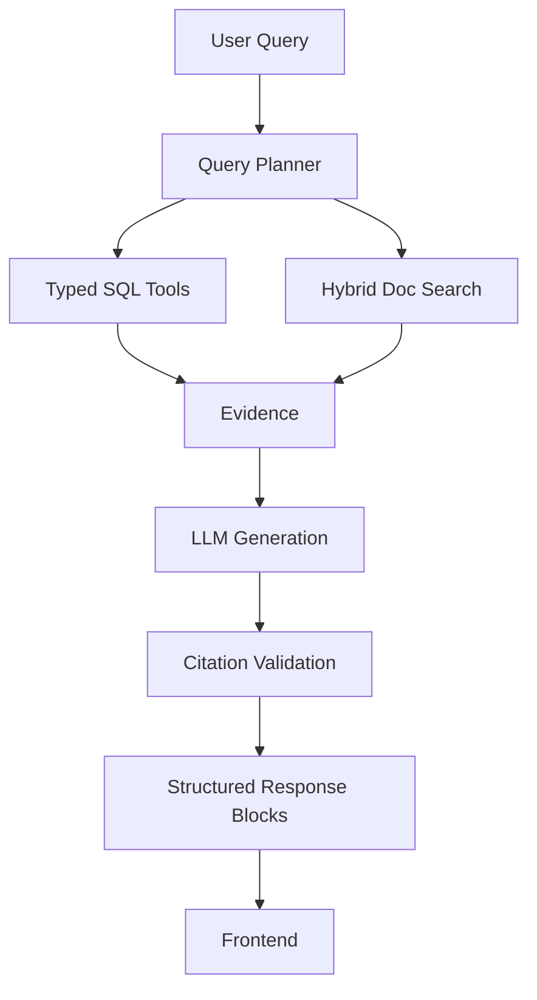

# Chat Architecture

```mermaid
graph TD
    User[User Query] --> Planner[Query Planner]
    Planner --> SQL[Typed SQL Tools]
    Planner --> Doc[Hybrid Doc Search]
    SQL --> Evidence
    Doc --> Evidence
    Evidence --> LLM[LLM Generation]
    LLM --> Validator[Citation Validation]
    Validator --> Block[Structured Response Blocks]
    Block --> Frontend
```
