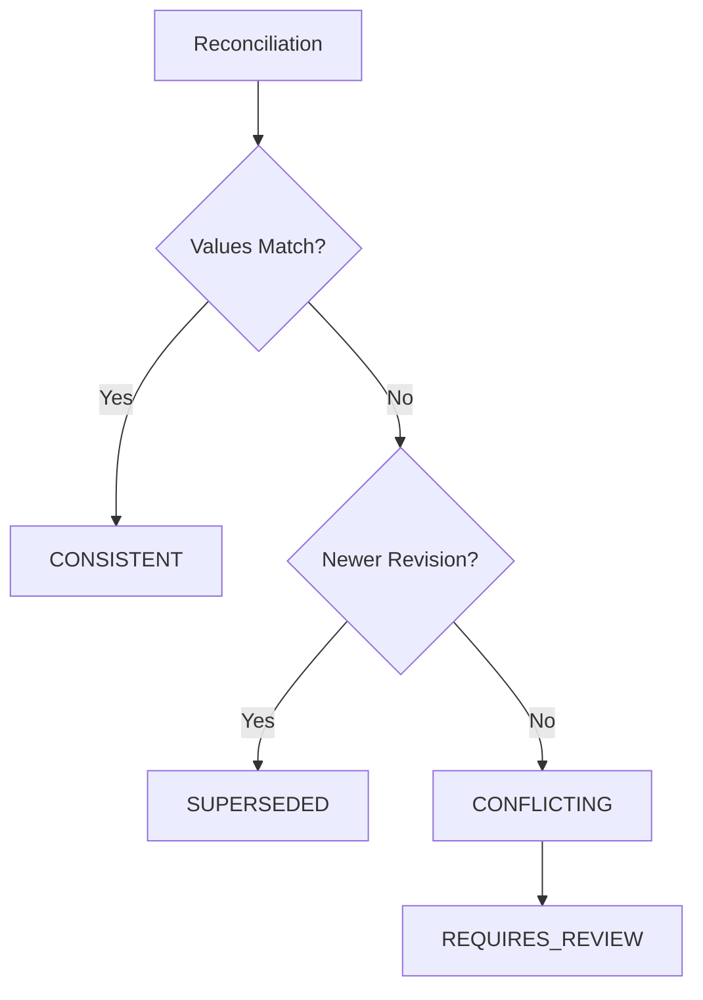

# Conflict Detection

```mermaid
graph TD
    Recon[Reconciliation] --> CheckValue{Values Match?}
    CheckValue -->|Yes| Cons[CONSISTENT]
    CheckValue -->|No| CheckDate{Newer Revision?}
    CheckDate -->|Yes| Super[SUPERSEDED]
    CheckDate -->|No| Conf[CONFLICTING]
    Conf --> Rev[REQUIRES_REVIEW]
```
