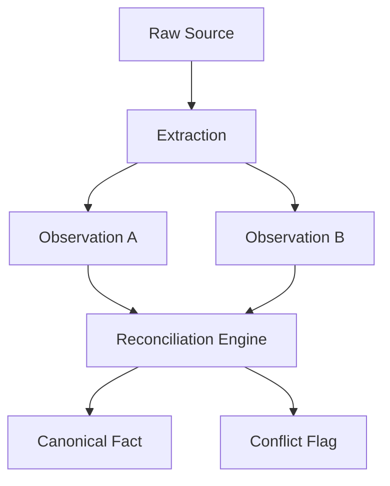

# Observation Flow

```mermaid
graph TD
    Source[Raw Source] --> Extract[Extraction]
    Extract --> ObsA[Observation A]
    Extract --> ObsB[Observation B]
    ObsA --> Recon[Reconciliation Engine]
    ObsB --> Recon
    Recon --> Canonical[Canonical Fact]
    Recon --> Conflict[Conflict Flag]
```
