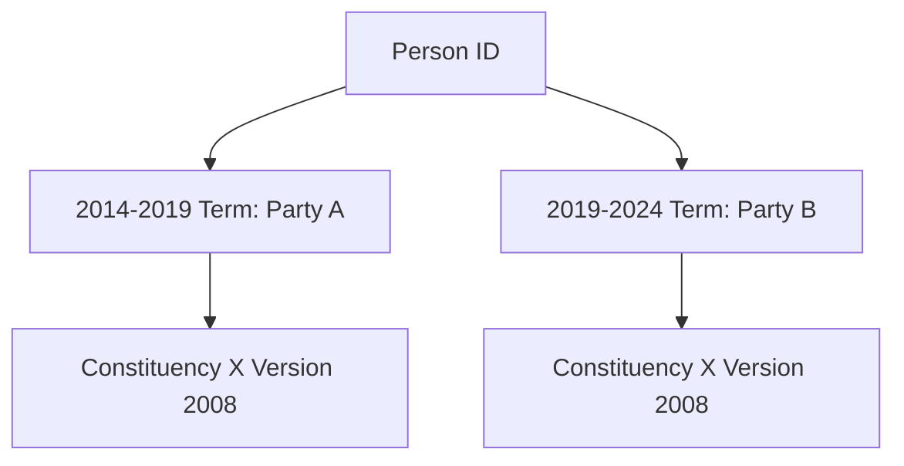

# Representative Timeline

```mermaid
graph TD
    Rep[Person ID] --> Term1[2014-2019 Term: Party A]
    Rep --> Term2[2019-2024 Term: Party B]
    Term1 --> Geo1[Constituency X Version 2008]
    Term2 --> Geo2[Constituency X Version 2008]
```
