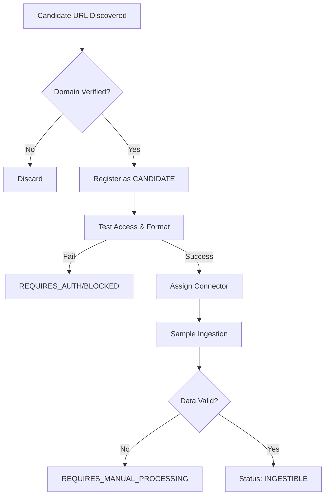

# Source Onboarding Lifecycle

```mermaid
graph TD
    Discover[Candidate URL Discovered] --> Verify{Domain Verified?}
    Verify -->|No| Reject[Discard]
    Verify -->|Yes| Reg[Register as CANDIDATE]
    Reg --> Test[Test Access & Format]
    Test -->|Fail| Auth[REQUIRES_AUTH/BLOCKED]
    Test -->|Success| Connect[Assign Connector]
    Connect --> Sample[Sample Ingestion]
    Sample --> Validate{Data Valid?}
    Validate -->|No| Manual[REQUIRES_MANUAL_PROCESSING]
    Validate -->|Yes| Approve[Status: INGESTIBLE]
```
