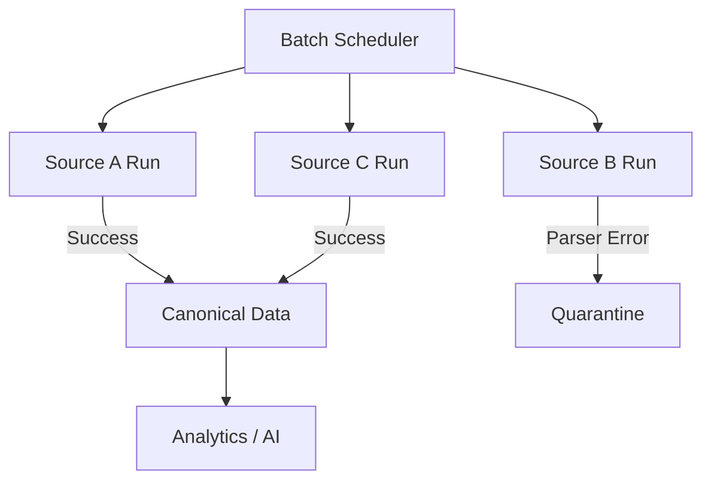

# Batch Ingestion Flow

```mermaid
graph TD
    Batch[Batch Scheduler] --> RunA[Source A Run]
    Batch --> RunB[Source B Run]
    Batch --> RunC[Source C Run]
    RunA -->|Success| Can[Canonical Data]
    RunB -->|Parser Error| Quar[Quarantine]
    RunC -->|Success| Can
    Can --> Anal[Analytics / AI]
```
