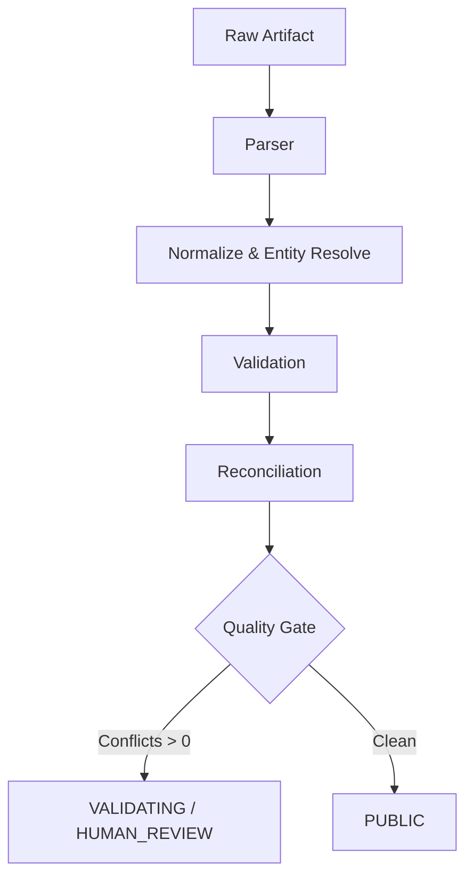

# Quality Gate Flow

```mermaid
graph TD
    Fetch[Raw Artifact] --> Parse[Parser]
    Parse --> Norm[Normalize & Entity Resolve]
    Norm --> Valid[Validation]
    Valid --> Recon[Reconciliation]
    Recon --> Gate{Quality Gate}
    Gate -->|Conflicts > 0| Val[VALIDATING / HUMAN_REVIEW]
    Gate -->|Clean| Pub[PUBLIC]
```
