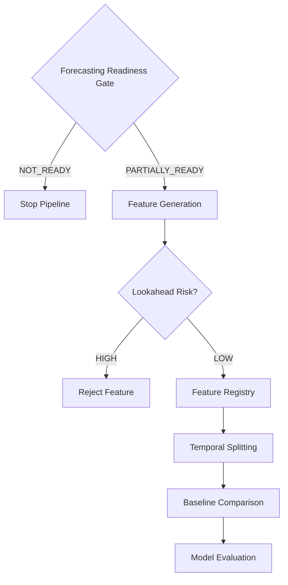

# Forecasting Data Pipeline

```mermaid
graph TD
    Readiness{Forecasting Readiness Gate}
    Readiness -->|NOT_READY| Halt[Stop Pipeline]
    Readiness -->|PARTIALLY_READY| Feat[Feature Generation]
    Feat --> Leakage{Lookahead Risk?}
    Leakage -->|HIGH| Reject[Reject Feature]
    Leakage -->|LOW| Registry[Feature Registry]
    Registry --> Backtest[Temporal Splitting]
    Backtest --> Base[Baseline Comparison]
    Base --> Eval[Model Evaluation]
```
