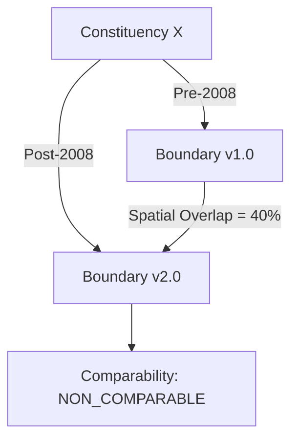

# Boundary Versioning

```mermaid
graph TD
    Const[Constituency X] -->|Pre-2008| B1[Boundary v1.0]
    Const -->|Post-2008| B2[Boundary v2.0]
    B1 -->|Spatial Overlap = 40%| B2
    B2 --> API[Comparability: NON_COMPARABLE]
```
