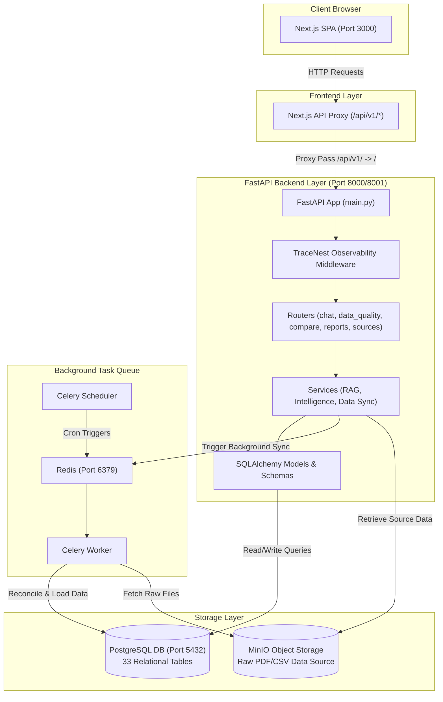
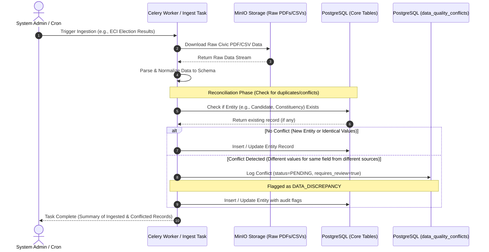
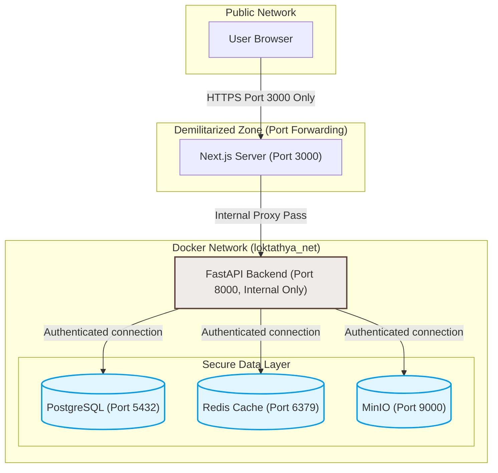
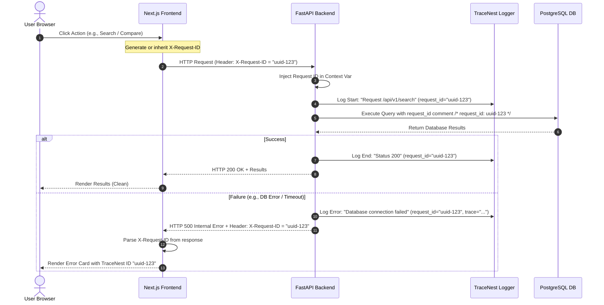

# LokTathya Architecture & Flow Diagrams

This document contains detailed flow, sequence, and structural architecture diagrams for the LokTathya platform. Every diagram is provided as standard Mermaid syntax and has an active rendering link generated via [Mermaid.ink](https://mermaid.ink/).

---

## 1. System Architecture Overview
An overview of the front-end SPA layer, the back-end FastAPI operational layer, background processing workers (Celery/Redis), and secure storage (PostgreSQL/MinIO).

### Rendered Diagram
[![System Architecture Overview](https://mermaid.ink/img/Zmxvd2NoYXJ0IFRCCiAgICBzdWJncmFwaCBDbGllbnQgWyJDbGllbnQgQnJvd3NlciJdCiAgICAgICAgVUlbIk5leHQuanMgU1BBIChQb3J0IDMwMDApIl0KICAgIGVuZAoKICAgIHN1YmdyYXBoIEZyb250RW5kIFsiRnJvbnRlbmQgTGF5ZXIiXQogICAgICAgIFByb3h5WyJOZXh0LmpzIEFQSSBQcm94eSAoL2FwaS92MS8qKSJdCiAgICBlbmQKCiAgICBzdWJncmFwaCBCYWNrRW5kIFsiRmFzdEFQSSBCYWNrZW5kIExheWVyIChQb3J0IDgwMDAvODAwMSkiXQogICAgICAgIEFQSVsiRmFzdEFQSSBBcHAgKG1haW4ucHkpIl0KICAgICAgICBSb3V0ZXJbIlJvdXRlcnMgKGNoYXQsIGRhdGFfcXVhbGl0eSwgY29tcGFyZSwgcmVwb3J0cywgc291cmNlcykiXQogICAgICAgIFNlcnZpY2VbIlNlcnZpY2VzIChSQUcsIEludGVsbGlnZW5jZSwgRGF0YSBTeW5jKSJdCiAgICAgICAgTW9kZWxzWyJTUUxBbGNoZW15IE1vZGVscyAmIFNjaGVtYXMiXQogICAgICAgIFRyYWNlTmVzdFsiVHJhY2VOZXN0IE9ic2VydmFiaWxpdHkgTWlkZGxld2FyZSJdCiAgICBlbmQKCiAgICBzdWJncmFwaCBRdWV1ZSBbIkJhY2tncm91bmQgVGFzayBRdWV1ZSJdCiAgICAgICAgUmVkaXNbIlJlZGlzIChQb3J0IDYzNzkpIl0KICAgICAgICBDZWxlcnlXb3JrZXJbIkNlbGVyeSBXb3JrZXIiXQogICAgICAgIENlbGVyeVNjaGVkWyJDZWxlcnkgU2NoZWR1bGVyIl0KICAgIGVuZAoKICAgIHN1YmdyYXBoIERhdGEgWyJTdG9yYWdlIExheWVyIl0KICAgICAgICBQb3N0Z3Jlc1soIlBvc3RncmVTUUwgREIgKFBvcnQgNTQzMilcbjMzIFJlbGF0aW9uYWwgVGFibGVzIildCiAgICAgICAgTWluSU9bKCJNaW5JTyBPYmplY3QgU3RvcmFnZVxuUmF3IFBERi9DU1YgRGF0YSBTb3VyY2UiKV0KICAgIGVuZAoKICAgIFVJIC0tPnxIVFRQIFJlcXVlc3RzfCBQcm94eQogICAgUHJveHkgLS0-fFByb3h5IFBhc3MgL2FwaS92MS8gLT4gL3wgQVBJCiAgICAKICAgIEFQSSAtLT4gVHJhY2VOZXN0CiAgICBUcmFjZU5lc3QgLS0-IFJvdXRlcgogICAgUm91dGVyIC0tPiBTZXJ2aWNlCiAgICBTZXJ2aWNlIC0tPiBNb2RlbHMKICAgIAogICAgU2VydmljZSAtLT58VHJpZ2dlciBCYWNrZ3JvdW5kIFN5bmN8IFJlZGlzCiAgICBSZWRpcyAtLT4gQ2VsZXJ5V29ya2VyCiAgICBDZWxlcnlTY2hlZCAtLT58Q3JvbiBUcmlnZ2Vyc3wgUmVkaXMKICAgIAogICAgTW9kZWxzIC0tPnxSZWFkL1dyaXRlIFF1ZXJpZXN8IFBvc3RncmVzCiAgICBDZWxlcnlXb3JrZXIgLS0-fFJlY29uY2lsZSAmIExvYWQgRGF0YXwgUG9zdGdyZXMKICAgIENlbGVyeVdvcmtlciAtLT58RmV0Y2ggUmF3IEZpbGVzfCBNaW5JTwogICAgU2VydmljZSAtLT58UmV0cmlldmUgU291cmNlIERhdGF8IE1pbklP)](https://mermaid.ink/img/Zmxvd2NoYXJ0IFRCCiAgICBzdWJncmFwaCBDbGllbnQgWyJDbGllbnQgQnJvd3NlciJdCiAgICAgICAgVUlbIk5leHQuanMgU1BBIChQb3J0IDMwMDApIl0KICAgIGVuZAoKICAgIHN1YmdyYXBoIEZyb250RW5kIFsiRnJvbnRlbmQgTGF5ZXIiXQogICAgICAgIFByb3h5WyJOZXh0LmpzIEFQSSBQcm94eSAoL2FwaS92MS8qKSJdCiAgICBlbmQKCiAgICBzdWJncmFwaCBCYWNrRW5kIFsiRmFzdEFQSSBCYWNrZW5kIExheWVyIChQb3J0IDgwMDAvODAwMSkiXQogICAgICAgIEFQSVsiRmFzdEFQSSBBcHAgKG1haW4ucHkpIl0KICAgICAgICBSb3V0ZXJbIlJvdXRlcnMgKGNoYXQsIGRhdGFfcXVhbGl0eSwgY29tcGFyZSwgcmVwb3J0cywgc291cmNlcykiXQogICAgICAgIFNlcnZpY2VbIlNlcnZpY2VzIChSQUcsIEludGVsbGlnZW5jZSwgRGF0YSBTeW5jKSJdCiAgICAgICAgTW9kZWxzWyJTUUxBbGNoZW15IE1vZGVscyAmIFNjaGVtYXMiXQogICAgICAgIFRyYWNlTmVzdFsiVHJhY2VOZXN0IE9ic2VydmFiaWxpdHkgTWlkZGxld2FyZSJdCiAgICBlbmQKCiAgICBzdWJncmFwaCBRdWV1ZSBbIkJhY2tncm91bmQgVGFzayBRdWV1ZSJdCiAgICAgICAgUmVkaXNbIlJlZGlzIChQb3J0IDYzNzkpIl0KICAgICAgICBDZWxlcnlXb3JrZXJbIkNlbGVyeSBXb3JrZXIiXQogICAgICAgIENlbGVyeVNjaGVkWyJDZWxlcnkgU2NoZWR1bGVyIl0KICAgIGVuZAoKICAgIHN1YmdyYXBoIERhdGEgWyJTdG9yYWdlIExheWVyIl0KICAgICAgICBQb3N0Z3Jlc1soIlBvc3RncmVTUUwgREIgKFBvcnQgNTQzMilcbjMzIFJlbGF0aW9uYWwgVGFibGVzIildCiAgICAgICAgTWluSU9bKCJNaW5JTyBPYmplY3QgU3RvcmFnZVxuUmF3IFBERi9DU1YgRGF0YSBTb3VyY2UiKV0KICAgIGVuZAoKICAgIFVJIC0tPnxIVFRQIFJlcXVlc3RzfCBQcm94eQogICAgUHJveHkgLS0-fFByb3h5IFBhc3MgL2FwaS92MS8gLT4gL3wgQVBJCiAgICAKICAgIEFQSSAtLT4gVHJhY2VOZXN0CiAgICBUcmFjZU5lc3QgLS0-IFJvdXRlcgogICAgUm91dGVyIC0tPiBTZXJ2aWNlCiAgICBTZXJ2aWNlIC0tPiBNb2RlbHMKICAgIAogICAgU2VydmljZSAtLT58VHJpZ2dlciBCYWNrZ3JvdW5kIFN5bmN8IFJlZGlzCiAgICBSZWRpcyAtLT4gQ2VsZXJ5V29ya2VyCiAgICBDZWxlcnlTY2hlZCAtLT58Q3JvbiBUcmlnZ2Vyc3wgUmVkaXMKICAgIAogICAgTW9kZWxzIC0tPnxSZWFkL1dyaXRlIFF1ZXJpZXN8IFBvc3RncmVzCiAgICBDZWxlcnlXb3JrZXIgLS0-fFJlY29uY2lsZSAmIExvYWQgRGF0YXwgUG9zdGdyZXMKICAgIENlbGVyeVdvcmtlciAtLT58RmV0Y2ggUmF3IEZpbGVzfCBNaW5JTwogICAgU2VydmljZSAtLT58UmV0cmlldmUgU291cmNlIERhdGF8IE1pbklP)

### Mermaid Syntax


---

## 2. Ingestion & Reconciliation Flow
This sequence details how raw PDF/CSV documents (from official sources like the Election Commission of India) are fetched from object storage, parsed, reconciled, and audited for anomalies (`DATA_DISCREPANCY` conflicts).

### Rendered Diagram
[![Ingestion & Reconciliation Flow](https://mermaid.ink/img/c2VxdWVuY2VEaWFncmFtCiAgICBhdXRvbnVtYmVyCiAgICBhY3RvciBBZG1pbiBhcyBTeXN0ZW0gQWRtaW4gLyBDcm9uCiAgICBwYXJ0aWNpcGFudCBDZWxlcnkgYXMgQ2VsZXJ5IFdvcmtlciAvIEluZ2VzdCBUYXNrCiAgICBwYXJ0aWNpcGFudCBNaW5JTyBhcyBNaW5JTyBTdG9yYWdlIChSYXcgUERGcy9DU1ZzKQogICAgcGFydGljaXBhbnQgREIgYXMgUG9zdGdyZVNRTCAoQ29yZSBUYWJsZXMpCiAgICBwYXJ0aWNpcGFudCBEUSBhcyBQb3N0Z3JlU1FMIChkYXRhX3F1YWxpdHlfY29uZmxpY3RzKQoKICAgIEFkbWluLT4-Q2VsZXJ5OiBUcmlnZ2VyIEluZ2VzdGlvbiAoZS5nLiwgRUNJIEVsZWN0aW9uIFJlc3VsdHMpCiAgICBDZWxlcnktPj5NaW5JTzogRG93bmxvYWQgUmF3IENpdmljIFBERi9DU1YgRGF0YQogICAgTWluSU8tLT4-Q2VsZXJ5OiBSZXR1cm4gUmF3IERhdGEgU3RyZWFtCiAgICBDZWxlcnktPj5DZWxlcnk6IFBhcnNlICYgTm9ybWFsaXplIERhdGEgdG8gU2NoZW1hCiAgICAKICAgIE5vdGUgb3ZlciBDZWxlcnksIERCOiBSZWNvbmNpbGlhdGlvbiBQaGFzZSAoQ2hlY2sgZm9yIGR1cGxpY2F0ZXMvY29uZmxpY3RzKQogICAgQ2VsZXJ5LT4-REI6IENoZWNrIGlmIEVudGl0eSAoZS5nLiwgQ2FuZGlkYXRlLCBDb25zdGl0dWVuY3kpIEV4aXN0cwogICAgREItLT4-Q2VsZXJ5OiBSZXR1cm4gZXhpc3RpbmcgcmVjb3JkIChpZiBhbnkpCiAgICAKICAgIGFsdCBObyBDb25mbGljdCAoTmV3IEVudGl0eSBvciBJZGVudGljYWwgVmFsdWVzKQogICAgICAgIENlbGVyeS0-PkRCOiBJbnNlcnQgLyBVcGRhdGUgRW50aXR5IFJlY29yZAogICAgZWxzZSBDb25mbGljdCBEZXRlY3RlZCAoRGlmZmVyZW50IHZhbHVlcyBmb3Igc2FtZSBmaWVsZCBmcm9tIGRpZmZlcmVudCBzb3VyY2VzKQogICAgICAgIENlbGVyeS0-PkRROiBMb2cgQ29uZmxpY3QgKHN0YXR1cz1QRU5ESU5HLCByZXF1aXJlc19yZXZpZXc9dHJ1ZSkKICAgICAgICBOb3RlIG92ZXIgQ2VsZXJ5LCBEUTogRmxhZ2dlZCBhcyBEQVRBX0RJU0NSRVBBTkNZCiAgICAgICAgQ2VsZXJ5LT4-REI6IEluc2VydCAvIFVwZGF0ZSBFbnRpdHkgd2l0aCBhdWRpdCBmbGFncwogICAgZW5kCiAgICAKICAgIENlbGVyeS0tPj5BZG1pbjogVGFzayBDb21wbGV0ZSAoU3VtbWFyeSBvZiBJbmdlc3RlZCAmIENvbmZsaWN0ZWQgUmVjb3Jkcyk=)](https://mermaid.ink/img/c2VxdWVuY2VEaWFncmFtCiAgICBhdXRvbnVtYmVyCiAgICBhY3RvciBBZG1pbiBhcyBTeXN0ZW0gQWRtaW4gLyBDcm9uCiAgICBwYXJ0aWNpcGFudCBDZWxlcnkgYXMgQ2VsZXJ5IFdvcmtlciAvIEluZ2VzdCBUYXNrCiAgICBwYXJ0aWNpcGFudCBNaW5JTyBhcyBNaW5JTyBTdG9yYWdlIChSYXcgUERGcy9DU1ZzKQogICAgcGFydGljaXBhbnQgREIgYXMgUG9zdGdyZVNRTCAoQ29yZSBUYWJsZXMpCiAgICBwYXJ0aWNpcGFudCBEUSBhcyBQb3N0Z3JlU1FMIChkYXRhX3F1YWxpdHlfY29uZmxpY3RzKQoKICAgIEFkbWluLT4-Q2VsZXJ5OiBUcmlnZ2VyIEluZ2VzdGlvbiAoZS5nLiwgRUNJIEVsZWN0aW9uIFJlc3VsdHMpCiAgICBDZWxlcnktPj5NaW5JTzogRG93bmxvYWQgUmF3IENpdmljIFBERi9DU1YgRGF0YQogICAgTWluSU8tLT4-Q2VsZXJ5OiBSZXR1cm4gUmF3IERhdGEgU3RyZWFtCiAgICBDZWxlcnktPj5DZWxlcnk6IFBhcnNlICYgTm9ybWFsaXplIERhdGEgdG8gU2NoZW1hCiAgICAKICAgIE5vdGUgb3ZlciBDZWxlcnksIERCOiBSZWNvbmNpbGlhdGlvbiBQaGFzZSAoQ2hlY2sgZm9yIGR1cGxpY2F0ZXMvY29uZmxpY3RzKQogICAgQ2VsZXJ5LT4-REI6IENoZWNrIGlmIEVudGl0eSAoZS5nLiwgQ2FuZGlkYXRlLCBDb25zdGl0dWVuY3kpIEV4aXN0cwogICAgREItLT4-Q2VsZXJ5OiBSZXR1cm4gZXhpc3RpbmcgcmVjb3JkIChpZiBhbnkpCiAgICAKICAgIGFsdCBObyBDb25mbGljdCAoTmV3IEVudGl0eSBvciBJZGVudGljYWwgVmFsdWVzKQogICAgICAgIENlbGVyeS0-PkRCOiBJbnNlcnQgLyBVcGRhdGUgRW50aXR5IFJlY29yZAogICAgZWxzZSBDb25mbGljdCBEZXRlY3RlZCAoRGlmZmVyZW50IHZhbHVlcyBmb3Igc2FtZSBmaWVsZCBmcm9tIGRpZmZlcmVudCBzb3VyY2VzKQogICAgICAgIENlbGVyeS0-PkRROiBMb2cgQ29uZmxpY3QgKHN0YXR1cz1QRU5ESU5HLCByZXF1aXJlc19yZXZpZXc9dHJ1ZSkKICAgICAgICBOb3RlIG92ZXIgQ2VsZXJ5LCBEUTogRmxhZ2dlZCBhcyBEQVRBX0RJU0NSRVBBTkNZCiAgICAgICAgQ2VsZXJ5LT4-REI6IEluc2VydCAvIFVwZGF0ZSBFbnRpdHkgd2l0aCBhdWRpdCBmbGFncwogICAgZW5kCiAgICAKICAgIENlbGVyeS0tPj5BZG1pbjogVGFzayBDb21wbGV0ZSAoU3VtbWFyeSBvZiBJbmdlc3RlZCAmIENvbmZsaWN0ZWQgUmVjb3Jkcyk=)

### Mermaid Syntax


---

## 3. RAG & Chatbot Pipeline Flow
The execution graph shows how the Civic AI agent answers natural-language queries. The pipeline fetches context from database entities, constructs a grounded system prompt containing strict guidelines (anti-hallucination policies), and sends it to the LLM.

### Rendered Diagram
[![RAG & Chatbot Pipeline Flow](https://mermaid.ink/img/Zmxvd2NoYXJ0IFRECiAgICBVc2VyKFtVc2VyIGluIFVJXSkgLS0-fEFzayBRdWVzdGlvbnwgQ2hhdFVJWyJDaXZpYyBBSSBQYWdlICgvY2l2aWMtYWkpIl0KICAgIENoYXRVSSAtLT58UE9TVCAvY2hhdC8gd2l0aCBwcm9tcHR8IEFQSVsiRmFzdEFQSSBDaGF0IFJvdXRlciJdCiAgICAKICAgIHN1YmdyYXBoIFJBR19QaXBlbGluZSBbIlJBRyBDb3JlIEluZ2VzdGlvbiAmIFJldHJpZXZhbCJdCiAgICAgICAgQVBJIC0tPnwxLiBQYXJzZSBSZXF1ZXN0fCBDaGF0U2VydmljZVsiQ2hhdCBTZXJ2aWNlIl0KICAgICAgICBDaGF0U2VydmljZSAtLT58Mi4gU2VhcmNoIFJlbGV2YW50IENvbnRleHR8IERCWyJQb3N0Z3JlU1FMIFNlYXJjaCBFbmdpbmUiXQogICAgICAgIERCIC0tPnxRdWVyeSBHZW9ncmFwaGllcywgUmVwcmVzZW50YXRpdmVzLCBFbGVjdGlvbnN8IFBvc3RncmVzVGFibGVzWygiMzMgQ29yZSBUYWJsZXMiKV0KICAgICAgICBQb3N0Z3Jlc1RhYmxlcyAtLT58UmV0dXJuIG1hdGNoZXMgJiBtZXRhZGF0YXwgREIKICAgICAgICBEQiAtLT58My4gUmV0dXJuIENvbnRleHR8IENoYXRTZXJ2aWNlCiAgICAgICAgCiAgICAgICAgQ2hhdFNlcnZpY2UgLS0-fDQuIEJ1aWxkIEdyb3VuZGVkIFByb21wdFxuKEFkZCBDb250ZXh0ICsgU3RyaWN0IEd1aWRlbGluZXMpfCBQcm9tcHRCdWlsZGVyWyJQcm9tcHQgQnVpbGRlciJdCiAgICAgICAgUHJvbXB0QnVpbGRlciAtLT58NS4gUmVxdWVzdCBSZXNwb25zZXwgTExNWyJMTE0gKENpdmljIEdyb3VuZGVkIEdlbmVyYXRvcikiXQogICAgICAgIExMTSAtLT58Ni4gR2VuZXJhdGUgUmVzcG9uc2Ugd2l0aCBDaXRhdGlvbnN8IFByb21wdEJ1aWxkZXIKICAgICAgICBQcm9tcHRCdWlsZGVyIC0tPnw3LiBGb3JtYXQgb3V0cHV0IGJsb2Nrc3wgQ2hhdFNlcnZpY2UKICAgIGVuZAogICAgCiAgICBDaGF0U2VydmljZSAtLT58OC4gUmV0dXJuIEFuc3dlciBCbG9ja3MgKyBUcmFjZU5lc3QgSUR8IENoYXRVSQogICAgQ2hhdFVJIC0tPnxSZW5kZXIgR3JvdW5kZWQgQW5zd2VyIHdpdGggQ2l0YXRpb25zfCBVc2Vy)](https://mermaid.ink/img/Zmxvd2NoYXJ0IFRECiAgICBVc2VyKFtVc2VyIGluIFVJXSkgLS0-fEFzayBRdWVzdGlvbnwgQ2hhdFVJWyJDaXZpYyBBSSBQYWdlICgvY2l2aWMtYWkpIl0KICAgIENoYXRVSSAtLT58UE9TVCAvY2hhdC8gd2l0aCBwcm9tcHR8IEFQSVsiRmFzdEFQSSBDaGF0IFJvdXRlciJdCiAgICAKICAgIHN1YmdyYXBoIFJBR19QaXBlbGluZSBbIlJBRyBDb3JlIEluZ2VzdGlvbiAmIFJldHJpZXZhbCJdCiAgICAgICAgQVBJIC0tPnwxLiBQYXJzZSBSZXF1ZXN0fCBDaGF0U2VydmljZVsiQ2hhdCBTZXJ2aWNlIl0KICAgICAgICBDaGF0U2VydmljZSAtLT58Mi4gU2VhcmNoIFJlbGV2YW50IENvbnRleHR8IERCWyJQb3N0Z3JlU1FMIFNlYXJjaCBFbmdpbmUiXQogICAgICAgIERCIC0tPnxRdWVyeSBHZW9ncmFwaGllcywgUmVwcmVzZW50YXRpdmVzLCBFbGVjdGlvbnN8IFBvc3RncmVzVGFibGVzWygiMzMgQ29yZSBUYWJsZXMiKV0KICAgICAgICBQb3N0Z3Jlc1RhYmxlcyAtLT58UmV0dXJuIG1hdGNoZXMgJiBtZXRhZGF0YXwgREIKICAgICAgICBEQiAtLT58My4gUmV0dXJuIENvbnRleHR8IENoYXRTZXJ2aWNlCiAgICAgICAgCiAgICAgICAgQ2hhdFNlcnZpY2UgLS0-fDQuIEJ1aWxkIEdyb3VuZGVkIFByb21wdFxuKEFkZCBDb250ZXh0ICsgU3RyaWN0IEd1aWRlbGluZXMpfCBQcm9tcHRCdWlsZGVyWyJQcm9tcHQgQnVpbGRlciJdCiAgICAgICAgUHJvbXB0QnVpbGRlciAtLT58NS4gUmVxdWVzdCBSZXNwb25zZXwgTExNWyJMTE0gKENpdmljIEdyb3VuZGVkIEdlbmVyYXRvcikiXQogICAgICAgIExMTSAtLT58Ni4gR2VuZXJhdGUgUmVzcG9uc2Ugd2l0aCBDaXRhdGlvbnN8IFByb21wdEJ1aWxkZXIKICAgICAgICBQcm9tcHRCdWlsZGVyIC0tPnw3LiBGb3JtYXQgb3V0cHV0IGJsb2Nrc3wgQ2hhdFNlcnZpY2UKICAgIGVuZAogICAgCiAgICBDaGF0U2VydmljZSAtLT58OC4gUmV0dXJuIEFuc3dlciBCbG9ja3MgKyBUcmFjZU5lc3QgSUR8IENoYXRVSQogICAgQ2hhdFVJIC0tPnxSZW5kZXIgR3JvdW5kZWQgQW5zd2VyIHdpdGggQ2l0YXRpb25zfCBVc2Vy)

### Mermaid Syntax
```mermaid
flowchart TD
    User([User in UI]) -->|Ask Question| ChatUI["Civic AI Page (/civic-ai)"]
    ChatUI -->|POST /chat/ with prompt| API["FastAPI Chat Router"]
    
    subgraph RAG_Pipeline ["RAG Core Ingestion & Retrieval"]
        API -->|1. Parse Request| ChatService["Chat Service"]
        ChatService -->|2. Search Relevant Context| DB["PostgreSQL Search Engine"]
        DB -->|Query Geographies, Representatives, Elections| PostgresTables[("33 Core Tables")]
        PostgresTables -->|Return matches & metadata| DB
        DB -->|3. Return Context| ChatService
        
        ChatService -->|4. Build Grounded Prompt\n(Add Context + Strict Guidelines)| PromptBuilder["Prompt Builder"]
        PromptBuilder -->|5. Request Response| LLM["LLM (Civic Grounded Generator)"]
        LLM -->|6. Generate Response with Citations| PromptBuilder
        PromptBuilder -->|7. Format output blocks| ChatService
    end
    
    ChatService -->|8. Return Answer Blocks + TraceNest ID| ChatUI
    ChatUI -->|Render Grounded Answer with Citations| User
```

---

## 4. Security & Data Isolation Architecture
Visualizes the security borders: external access is strictly limited to the Next.js reverse proxy (port 3000), keeping backend engines and storage instances isolated on a private docker virtual network (`loktathya_net`).

### Rendered Diagram
[![Security & Data Isolation Architecture](https://mermaid.ink/img/Zmxvd2NoYXJ0IFRCCiAgICBzdWJncmFwaCBFeHRlcm5hbCBbIlB1YmxpYyBOZXR3b3JrIl0KICAgICAgICBDbGllbnRbIlVzZXIgQnJvd3NlciJdCiAgICBlbmQKCiAgICBzdWJncmFwaCBETVogWyJEZW1pbGl0YXJpemVkIFpvbmUgKFBvcnQgRm9yd2FyZGluZykiXQogICAgICAgIFByb3h5WyJOZXh0LmpzIFNlcnZlciAoUG9ydCAzMDAwKSJdCiAgICBlbmQKCiAgICBzdWJncmFwaCBJbnRlcm5hbCBbIkRvY2tlciBOZXR3b3JrIChsb2t0YXRoeWFfbmV0KSJdCiAgICAgICAgQVBJWyJGYXN0QVBJIEJhY2tlbmQgKFBvcnQgODAwMCwgSW50ZXJuYWwgT25seSkiXQogICAgICAgIAogICAgICAgIHN1YmdyYXBoIERhdGFiYXNlcyBbIlNlY3VyZSBEYXRhIExheWVyIl0KICAgICAgICAgICAgUG9zdGdyZXNbKCJQb3N0Z3JlU1FMIChQb3J0IDU0MzIpIildCiAgICAgICAgICAgIFJlZGlzWygiUmVkaXMgQ2FjaGUgKFBvcnQgNjM3OSkiKV0KICAgICAgICAgICAgTWluSU9bKCJNaW5JTyAoUG9ydCA5MDAwKSIpXQogICAgICAgIGVuZAogICAgZW5kCgogICAgQ2xpZW50IC0tPnxIVFRQUyBQb3J0IDMwMDAgT25seXwgUHJveHkKICAgIFByb3h5IC0tPnxJbnRlcm5hbCBQcm94eSBQYXNzfCBBUEkKICAgIAogICAgQVBJIC0tPnxBdXRoZW50aWNhdGVkIGNvbm5lY3Rpb258IFBvc3RncmVzCiAgICBBUEkgLS0-fEF1dGhlbnRpY2F0ZWQgY29ubmVjdGlvbnwgUmVkaXMKICAgIEFQSSAtLT58QXV0aGVudGljYXRlZCBjb25uZWN0aW9ufCBNaW5JTwogICAgCiAgICBjbGFzc0RlZiBzZWN1cmUgZmlsbDojZTFmNWZlLHN0cm9rZTojMDM5YmU1LHN0cm9rZS13aWR0aDoycHg7CiAgICBjbGFzc0RlZiBpc29sYXRlIGZpbGw6I2VmZWJlOSxzdHJva2U6IzVkNDAzNyxzdHJva2Utd2lkdGg6MnB4OwogICAgY2xhc3MgUG9zdGdyZXMsUmVkaXMsTWluSU8gc2VjdXJlOwogICAgY2xhc3MgQVBJIGlzb2xhdGU7)](https://mermaid.ink/img/Zmxvd2NoYXJ0IFRCCiAgICBzdWJncmFwaCBFeHRlcm5hbCBbIlB1YmxpYyBOZXR3b3JrIl0KICAgICAgICBDbGllbnRbIlVzZXIgQnJvd3NlciJdCiAgICBlbmQKCiAgICBzdWJncmFwaCBETVogWyJEZW1pbGl0YXJpemVkIFpvbmUgKFBvcnQgRm9yd2FyZGluZykiXQogICAgICAgIFByb3h5WyJOZXh0LmpzIFNlcnZlciAoUG9ydCAzMDAwKSJdCiAgICBlbmQKCiAgICBzdWJncmFwaCBJbnRlcm5hbCBbIkRvY2tlciBOZXR3b3JrIChsb2t0YXRoeWFfbmV0KSJdCiAgICAgICAgQVBJWyJGYXN0QVBJIEJhY2tlbmQgKFBvcnQgODAwMCwgSW50ZXJuYWwgT25seSkiXQogICAgICAgIAogICAgICAgIHN1YmdyYXBoIERhdGFiYXNlcyBbIlNlY3VyZSBEYXRhIExheWVyIl0KICAgICAgICAgICAgUG9zdGdyZXNbKCJQb3N0Z3JlU1FMIChQb3J0IDU0MzIpIildCiAgICAgICAgICAgIFJlZGlzWygiUmVkaXMgQ2FjaGUgKFBvcnQgNjM3OSkiKV0KICAgICAgICAgICAgTWluSU9bKCJNaW5JTyAoUG9ydCA5MDAwKSIpXQogICAgICAgIGVuZAogICAgZW5kCgogICAgQ2xpZW50IC0tPnxIVFRQUyBQb3J0IDMwMDAgT25seXwgUHJveHkKICAgIFByb3h5IC0tPnxJbnRlcm5hbCBQcm94eSBQYXNzfCBBUEkKICAgIAogICAgQVBJIC0tPnxBdXRoZW50aWNhdGVkIGNvbm5lY3Rpb258IFBvc3RncmVzCiAgICBBUEkgLS0-fEF1dGhlbnRpY2F0ZWQgY29ubmVjdGlvbnwgUmVkaXMKICAgIEFQSSAtLT58QXV0aGVudGljYXRlZCBjb25uZWN0aW9ufCBNaW5JTwogICAgCiAgICBjbGFzc0RlZiBzZWN1cmUgZmlsbDojZTFmNWZlLHN0cm9rZTojMDM5YmU1LHN0cm9rZS13aWR0aDoycHg7CiAgICBjbGFzc0RlZiBpc29sYXRlIGZpbGw6I2VmZWJlOSxzdHJva2U6IzVkNDAzNyxzdHJva2Utd2lkdGg6MnB4OwogICAgY2xhc3MgUG9zdGdyZXMsUmVkaXMsTWluSU8gc2VjdXJlOwogICAgY2xhc3MgQVBJIGlzb2xhdGU7)

### Mermaid Syntax


---

## 5. Observability & Request Tracing (TraceNest)
Demonstrates request validation and TraceNest ID generation/propagation. If a transaction fails (e.g. database disconnect), the transaction is printed to standard logs alongside the `X-Request-ID` token, which is then parsed and formatted on the user's screen inside an error state module.

### Rendered Diagram
[![TraceNest Request Tracing Sequence](https://mermaid.ink/img/c2VxdWVuY2VEaWFncmFtCiAgICBhdXRvbnVtYmVyCiAgICBhY3RvciBVc2VyIGFzIFVzZXIgQnJvd3NlcgogICAgcGFydGljaXBhbnQgRkUgYXMgTmV4dC5qcyBGcm9udGVuZAogICAgcGFydGljaXBhbnQgQkUgYXMgRmFzdEFQSSBCYWNrZW5kCiAgICBwYXJ0aWNpcGFudCBMb2dnZXIgYXMgVHJhY2VOZXN0IExvZ2dlcgogICAgcGFydGljaXBhbnQgREIgYXMgUG9zdGdyZVNRTCBEQgoKICAgIFVzZXItPj5GRTogQ2xpY2sgQWN0aW9uIChlLmcuLCBTZWFyY2ggLyBDb21wYXJlKQogICAgTm90ZSBvdmVyIEZFOiBHZW5lcmF0ZSBvciBpbmhlcml0IFgtUmVxdWVzdC1JRAogICAgRkUtPj5CRTogSFRUUCBSZXF1ZXN0IChIZWFkZXI6IFgtUmVxdWVzdC1JRCA9ICJ1dWlkLTEyMyIpCiAgICAKICAgIEJFLT4-QkU6IEluamVjdCBSZXF1ZXN0IElEIGluIENvbnRleHQgVmFyCiAgICBCRS0-PkxvZ2dlcjogTG9nIFN0YXJ0OiAiUmVxdWVzdCAvYXBpL3YxL3NlYXJjaCIgKHJlcXVlc3RfaWQ9InV1aWQtMTIzIikKICAgIAogICAgQkUtPj5EQjogRXhlY3V0ZSBRdWVyeSB3aXRoIHJlcXVlc3RfaWQgY29tbWVudCAvKiByZXF1ZXN0X2lkOiB1dWlkLTEyMyAqLwogICAgREItLT4-QkU6IFJldHVybiBEYXRhYmFzZSBSZXN1bHRzCiAgICAKICAgIGFsdCBTdWNjZXNzCiAgICAgICAgQkUtPj5Mb2dnZXI6IExvZyBFbmQ6ICJTdGF0dXMgMjAwIiAocmVxdWVzdF9pZD0idXVpZC0xMjMiKQogICAgICAgIEJFLS0-PkZFOiBIVFRQIDIwMCBPSyArIFJlc3VsdHMKICAgICAgICBGRS0tPj5Vc2VyOiBSZW5kZXIgUmVzdWx0cyAoQ2xlYW4pCiAgICBlbHNlIEZhaWx1cmUgKGUuZy4sIERCIEVycm9yIC8gVGltZW91dCkKICAgICAgICBCRS0-PkxvZ2dlcjogTG9nIEVycm9yOiAiRGF0YWJhc2UgY29ubmVjdGlvbiBmYWlsZWQiIChyZXF1ZXN0X2lkPSJ1dWlkLTEyMyIsIHRyYWNlPSIuLi4iKQogICAgICAgIEJFLS0-PkZFOiBIVFRQIDUwMCBJbnRlcm5hbCBFcnJvciArIEhlYWRlcjogWC1SZXF1ZXN0LUlEID0gInV1aWQtMTIzIgogICAgICAgIEZFLT4-RkU6IFBhcnNlIFgtUmVxdWVzdC1JRCBmcm9tIHJlc3BvbnNlCiAgICAgICAgRkUtLT4-VXNlcjogUmVuZGVyIEVycm9yIENhcmQgd2l0aCBUcmFjZU5lc3QgSUQgInV1aWQtMTIzIgogICAgZW5k)](https://mermaid.ink/img/c2VxdWVuY2VEaWFncmFtCiAgICBhdXRvbnVtYmVyCiAgICBhY3RvciBVc2VyIGFzIFVzZXIgQnJvd3NlcgogICAgcGFydGljaXBhbnQgRkUgYXMgTmV4dC5qcyBGcm9udGVuZAogICAgcGFydGljaXBhbnQgQkUgYXMgRmFzdEFQSSBCYWNrZW5kCiAgICBwYXJ0aWNpcGFudCBMb2dnZXIgYXMgVHJhY2VOZXN0IExvZ2dlcgogICAgcGFydGljaXBhbnQgREIgYXMgUG9zdGdyZVNRTCBEQgoKICAgIFVzZXItPj5GRTogQ2xpY2sgQWN0aW9uIChlLmcuLCBTZWFyY2ggLyBDb21wYXJlKQogICAgTm90ZSBvdmVyIEZFOiBHZW5lcmF0ZSBvciBpbmhlcml0IFgtUmVxdWVzdC1JRAogICAgRkUtPj5CRTogSFRUUCBSZXF1ZXN0IChIZWFkZXI6IFgtUmVxdWVzdC1JRCA9ICJ1dWlkLTEyMyIpCiAgICAKICAgIEJFLT4-QkU6IEluamVjdCBSZXF1ZXN0IElEIGluIENvbnRleHQgVmFyCiAgICBCRS0-PkxvZ2dlcjogTG9nIFN0YXJ0OiAiUmVxdWVzdCAvYXBpL3YxL3NlYXJjaCIgKHJlcXVlc3RfaWQ9InV1aWQtMTIzIikKICAgIAogICAgQkUtPj5EQjogRXhlY3V0ZSBRdWVyeSB3aXRoIHJlcXVlc3RfaWQgY29tbWVudCAvKiByZXF1ZXN0X2lkOiB1dWlkLTEyMyAqLwogICAgREItLT4-QkU6IFJldHVybiBEYXRhYmFzZSBSZXN1bHRzCiAgICAKICAgIGFsdCBTdWNjZXNzCiAgICAgICAgQkUtPj5Mb2dnZXI6IExvZyBFbmQ6ICJTdGF0dXMgMjAwIiAocmVxdWVzdF9pZD0idXVpZC0xMjMiKQogICAgICAgIEJFLS0-PkZFOiBIVFRQIDIwMCBPSyArIFJlc3VsdHMKICAgICAgICBGRS0tPj5Vc2VyOiBSZW5kZXIgUmVzdWx0cyAoQ2xlYW4pCiAgICBlbHNlIEZhaWx1cmUgKGUuZy4sIERCIEVycm9yIC8gVGltZW91dCkKICAgICAgICBCRS0-PkxvZ2dlcjogTG9nIEVycm9yOiAiRGF0YWJhc2UgY29ubmVjdGlvbiBmYWlsZWQiIChyZXF1ZXN0X2lkPSJ1dWlkLTEyMyIsIHRyYWNlPSIuLi4iKQogICAgICAgIEJFLS0-PkZFOiBIVFRQIDUwMCBJbnRlcm5hbCBFcnJvciArIEhlYWRlcjogWC1SZXF1ZXN0LUlEID0gInV1aWQtMTIzIgogICAgICAgIEZFLT4-RkU6IFBhcnNlIFgtUmVxdWVzdC1JRCBmcm9tIHJlc3BvbnNlCiAgICAgICAgRkUtLT4-VXNlcjogUmVuZGVyIEVycm9yIENhcmQgd2l0aCBUcmFjZU5lc3QgSUQgInV1aWQtMTIzIgogICAgZW5k)

### Mermaid Syntax

