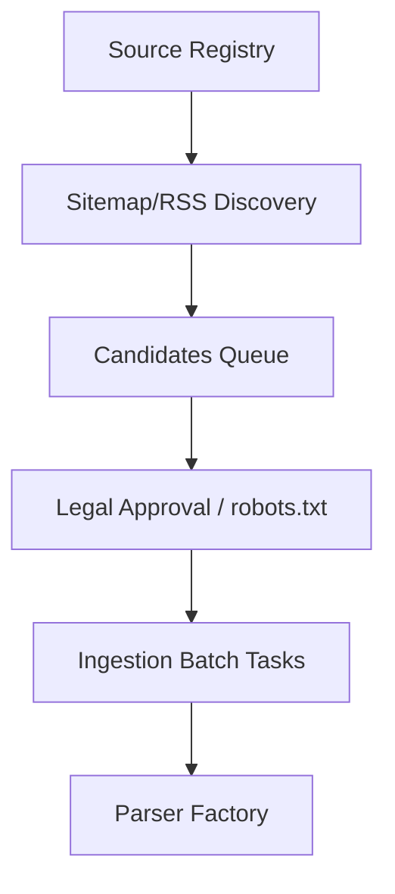

# Phase 7 Acquisition Architecture

This document describes the design and flow of the LokTathya Data Acquisition Factory.

---

## 1. Process Flow

## 2. Ingestion Stages
- **DISCOVERY**: Extract targets via Sitemap indexes or RSS.
- **VALIDATION**: Run SSRF checking and access compliance checks.
- **FETCH**: Resilient HTTP retrieval with exponential retry backoff.
- **PARSING**: defused format extraction matching mime types and magic bytes.
- **RECONCILIATION**: Observational storage with complete history preservation.
